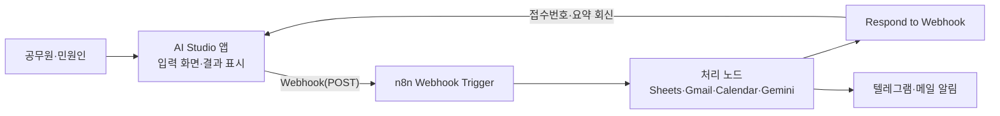

# AI 앱 + n8n 업무 자동화 서비스 과정 제안서

> 원본: `docs/n8n-proposal.pdf` (2026-09-22). 이 파일은 PDF의 텍스트를 Markdown으로 옮긴 것이다.
> 이후 세션은 PDF 대신 이 파일을 읽는다. 표는 PDF 레이아웃에서 복원했으며, 원문 오탈자(캠버스→캔버스, 캐처→캡처, 업벙→업무, 뿐내기→뽐내기)는 바로잡았다.
> 그림 0·1·2·7(직접 그린 목업·구성도)은 PDF 안의 이미지라 텍스트로 옮기지 못했다 → PNG는 `assets/proposal/`에 둔다.
>
> **교안 명세로 쓰는 절**: 6(교육내용) · 7(시간표) · 8-3(세부학습내용) · 9~10(산출물·그림) · 11(운영 유의사항)
> 제안서의 사실 주장(AI Studio·n8n 기능)은 검증 전이다 → `docs/fact-check.md` 참고.

「AI를 활용한 나만의 비서 만들기(n8n)」 1·2기 운영 결과와 수강생 설문을 반영해, 프로그래밍을 모르는 공무원이 Google AI Studio로 앱 화면을 만들고 n8n으로 뒷단 자동화를 붙여 실제 서비스를 완성하는 2일(14시간) 심화 과정을 제안한다. 3~9절은 신규 과정 제안서 양식의 항목 순서를 그대로 따른다.

---

## 1. 기존 과정·설문·교안 분석 요약

강사 전문성과 실습 방식은 이미 검증됐다. 낮은 점수는 "내 업무에 바로 쓰기 어렵다"와 "수준 차이·시간 부족" 두 곳에 몰려 있다. 신규 과정은 이 두 가지를 구조적으로 해결하는 데 집중한다.

**기존 과정** (1기 2025.9 / 2기 2026.9, 2일 14시간)

- 1일차: n8n 기본 → 구글 시트 기록 → Gmail 발송 → 캘린더 → Gemini 안내문 → If 분기 → Form Trigger로 민원 접수 폼 완성 (교안 01~08강)
- 2일차: 4개 프로젝트(P1 PDF 공문 요약, P2 아침 민원 브리핑, P3 AI 민원 분류·답변, P4 날씨 알리미) + 추가자료(설문 자동 분석)
- 사용 도구: n8n 클라우드, Google Sheets·Gmail·Calendar·Form, Gemini API, Telegram, 기상청 API

**2기 수료 설문(26명) 문항별 점수** — 1=매우 그렇다, 5=매우 그렇지 않다(낮을수록 좋음)

| 문항 | 평균 | 해석 |
|---|---|---|
| 학습성취·참여정도·교육시간 | 1.42 | 최상 |
| 운영지원 | 1.46 | 우수 |
| 역량향상·교과편성 | 1.58 | 우수 |
| 교육만족 | 1.65 | 양호 |
| 교육효과(목표 달성) | 1.69 | 양호 |
| 기대충족 | 1.85 | 보완 필요 |
| 추천의사 | 1.88 | 보완 필요 |
| 현업도움 | 2.04 | 가장 낮음 — 핵심 개선 대상 |

교과목·강사 평가(48건): 강사전문성 "매우 그렇다" 43건(90%), 교과목 적합성 37건, 교육방법 35건.

**주관식 개선 요구** (2개 설문 합산, 언급 횟수 기준)

| 요구 | 언급 | 신규 과정 반영 방식 |
|---|---|---|
| 수준별 분반(초급·중급·고급으로 이어지는 과정) | 8회 | 본 과정을 중급(심화)으로 신설, 기존 과정은 초급으로 유지·연계 |
| 교육시간 부족 → 3일 확대 | 7회 | 2일 14시간으로 편성하되 이론 축소·완성 파일 제공으로 실습 시간 확보, 2일차 오후 4시간을 "내 업무 서비스 제작"에 배정(3일 확대안 병기) |
| 실무 적용 사례·내 업무 시나리오 구체화 시간 | 6회 | 입과 전 자동화 희망 업무 사전조사 → 공통 사례 선정, 2일차 오후 개인·팀 프로젝트 |
| 보조강사·조교 필요 | 4회 | 보조강사 1명 편성, 단계별 완성 워크플로우 파일 제공 |
| 개념·기초 설명 보강 | 3회 | **매 실습 앞에 10분 개념 블록(왜 이 노드가 필요한가) 고정** |
| 진행 속도 조절·인원 축소 | 3회 | 20명 내외 권장, **완성본 제공으로 뒤처진 수강생 즉시 복구** |
| 교재 인쇄·강의자료 제공 | 2회 | 웹 교안 + 인쇄 교재(자체파일) 병행 |
| n8n + React(앱 제작)까지 3일 1회 코스 | 1회 | AI Studio로 앱 화면 제작 → n8n 연동이 본 과정의 핵심 |
| 말로 하는 Gemini·Claude | 1회 | 음성 입력(브라우저 음성 인식)을 선택 실습으로 제공 |

환경 요구(와이파이·숙소·식사)는 운영기관 사항으로 유의사항 절에만 적었다.

## 2. 실현 가능성 검토 — AI Studio 앱 + n8n 연동

가능하다. 필요한 기술 요소는 "AI Studio가 만든 앱이 n8n Webhook 주소로 데이터를 보내고, n8n이 처리 결과를 돌려준다" 하나뿐이며, 수강생은 코드를 한 줄도 직접 쓰지 않는다. 기존 교안의 Form Trigger 자리에 Webhook Trigger가 들어가고, 뒷단(시트·메일·캘린더·Gemini)은 그대로 재사용된다.

**역할 분담 — "화면은 AI가, 일은 n8n이"**

앱은 입력과 표시만 담당하고, 기록·발송·AI 생성은 모두 이미 배운 n8n 노드가 처리한다.

**비개발자가 따라올 수 있는 근거**

- Google AI Studio의 Build 모드는 한글 문장(프롬프트)만으로 웹 앱을 생성·수정하며, 구글 계정만 있으면 무료로 사용한다. 만든 앱은 공유 링크로 바로 열어볼 수 있고, 외부 주소(n8n Webhook) 호출이 허용된다. Gemini API 키는 서버 쪽 비밀값으로 자동 보관되어 수강생이 키를 코드에 넣을 일이 없다. (공식 문서) ← **검증 필요**
- 강사가 검증한 프롬프트 템플릿("민원 접수 앱을 만들어줘. 이름·연락처·민원 내용을 입력받아 이 주소로 POST 하고 응답의 접수번호를 보여줘")을 배포하면 결과 편차가 작다.
- 오류가 나면 "오류 문구를 복사해 AI에 붙여넣고 고쳐 달라고 한다"는 단일 루틴만 가르치면 된다.

**제약과 수업에서의 해결책**

| 제약 | 수업 설계에서의 해결 |
|---|---|
| n8n Webhook은 브라우저 앱에서 호출 시 CORS 허용이 필요 | Webhook 노드 옵션 "Allowed Origins(CORS)"에 `*` 또는 앱 주소 입력 — 1일차 Webhook 실습 체크리스트 1번 항목으로 고정 |
| Test URL / Production URL 혼동(가장 흔한 실수) | 워크플로우 활성화(Active) 후 Production URL만 앱에 넣도록 순서를 교안에 명시 |
| n8n 클라우드 무료 체험은 기간 제한 | 1·2기와 동일하게 수업용 계정 안내, 수료 후 기관 설치(자체 서버)형 전환 방법을 2일차 배포·보안 시간에 안내 |
| AI Studio 배포 중 Cloud Run 배포는 결제 계정 필요 | 수업에서는 무료 공유 링크만 사용, Cloud Run은 소개만 |
| 교육망에서 해외 사이트·클라우드 차단 가능 | 과정운영개요의 교재/사용 SW 란에 예외처리 도메인 목록 기재(5절) |
| 실제 민원 데이터 사용 시 개인정보 문제 | 실습은 가상 데이터만 사용, 2일차 배포·보안 시간에 "실제 적용 전 점검 체크리스트" 제공 |
| 수강생 수준 차이 | 기초지식을 "n8n 기초과정 수료 또는 동등 수준"으로 명시, 1일차 오전에 압축 복습, 단계별 완성 파일(JSON) 제공 |

**대체·보완 도구** — AI Studio 접속이 막힐 경우를 대비해 Gemini 캔버스(웹 미리보기)나 n8n 자체 Form을 백업 경로로 준비한다. 들어오는 방식만 다를 뿐 n8n 워크플로우는 동일하다.

## 3. 과정명 및 과정개요

- **과정명**: 「AI 앱과 n8n으로 만드는 나만의 업무 자동화 서비스」 과정 세부계획(안)
- **부제**: 코딩 없이 앱 만들고 자동화 연결하기 — 「AI를 활용한 나만의 비서 만들기(n8n)」 심화(중급) 과정
- **교육목표**: 무료 AI 앱 빌더(Google AI Studio)로 업무용 앱 화면을 만들고 n8n 자동화와 연동하여, 접수→처리→알림→보고로 이어지는 나만의 업무 자동화 서비스를 직접 구축·배포하는 능력 향상
- **교육대상**: 국가직 또는 지방직 공무원(일반 사무) 중 「AI를 활용한 나만의 비서 만들기(n8n)」 수료자 또는 n8n 기본 워크플로우(트리거–처리–결과) 구성 경험이 있는 자 ※ 프로그래밍 경험 불필요
- **교육기간**: 2일(14시간) — 중급
  - ※ 3일 확대 시: 2일차 오후 프로젝트를 3일차 하루(7시간)로 늘리고, 선택 실습(파일·음성)을 정규 교시로 편성 *(현재 교안 범위에서는 제외)*

## 4. 강사정보

| 구분 | 성명 | 소속(직위) | 주요 경력 |
|---|---|---|---|
| 주강사 | 김기태 | 인하공업전문대학(조교수) | 「AI를 활용한 나만의 비서 만들기(n8n)」 1·2기 강의(2025~2026), 중앙공무원 정보화 교육, 중등교사 AI 연수 교육, 한국인공지능교육학회 이사 |
| 보조강사 | (성명 기재) | (소속) | n8n 워크플로우 실습 지도, 수강생 개별 오류 해결 및 진도 보조 |

## 5. 과정운영개요

- **과정개요**: 노코드 AI 앱 빌더와 n8n 자동화를 연동하는 서비스 구축 프로세스를 이해하고, 민원 접수·공문 요약·현장 보고 등 반복 행정업무를 앱 형태로 자동화하는 방법 및 부서 업무 적용사례 습득
- **과정분류**: 업무자동화 / **난이도**: 중
- **기초지식**: n8n 기초 과정 수료 또는 동등 수준(트리거–처리–결과 워크플로우 구성, 구글 시트 연동 경험). 프로그래밍 경험 불필요
- **교재/사용 SW**: 「AI 앱과 n8n으로 만드는 나만의 업무 자동화 서비스」(자체파일: 웹 교안 + 인쇄 교재 배부) / Google AI Studio(무료), n8n(무료), Gemini API(무료), Google Sheets·Gmail·Calendar·Form, Telegram
- **교육망 예외처리 요청 도메인**: `aistudio.google.com`, `*.n8n.cloud`(또는 강사 제공 n8n 서버 주소), `generativelanguage.googleapis.com`, `*.google.com`(Sheets·Gmail·Calendar·Form·로그인), `api.telegram.org`, `web.telegram.org`, `apis.data.go.kr`(기상청 공공데이터)
- 수강생 개인 구글 계정 및 텔레그램 계정 사전 준비 필요

## 6. 교육내용 (일차별 주요교육내용·시간)

계 14시간. 괄호 안은 시간.

| 구분 | 주요교육내용 | 계 | 강의 | 참여 | 기타 |
|---|---|---|---|---|---|
| 1일차 | 입과 안내·완성 서비스 시연 및 n8n 핵심 복습: 트리거–처리–결과, 표현식, 시트·메일·Gemini (2) / Webhook 이해와 실습: 앱과 자동화가 대화하는 방법, Test/Production URL, CORS, Respond to Webhook (1) / AI 앱 빌더 첫 체험: Google AI Studio Build로 민원 접수 화면 만들기, 프롬프트 템플릿·오류 대처 루틴 (2) / 앱 ↔ n8n 연동 ①: 접수 → 시트 기록 → 접수번호 회신·화면 표시 (2) | 7 | ○ | ○ | |
| 2일차 | 앱 ↔ n8n 연동 ②: 담당자 메일·캘린더·Gemini 안내문·조건 분기·텔레그램 알림·처리상태 조회 (2) / 앱 배포·공유·보안: 공유 링크, 비밀값(API 키) 관리, 개인정보 점검표, 기관 설치형 n8n 안내 (1) / 나만의 업무 서비스 프로젝트: 기획(시나리오·설계서) 1 + 제작(앱 생성·연동·테스트) 2 + 발표·피드백·적용 로드맵 1 (4) | 7 | ○ | ○ | ○ |
| 선택 | 파일·음성 다루기(선택 실습): PDF 공문 업로드 요약 앱, 음성 입력 민원 접수 — 2일차 프로젝트 제작 시간 중 희망자 진행, 웹 교안·완성 파일로 수료 후 자율학습 | - | | ○ | |
| 계 | | 14 | | | |

시간 배분: 1일차 2+1+2+2, 2일차 2+1+4 = 14. 선택 실습은 "선택(시간 외)".

## 7. 시간표

오전 3교시·오후 4교시, 하루 7시간 × 2일 = 14시간. **각 교시 시작 10분은 개념 설명(왜 이 단계가 필요한가), 나머지는 실습.**

| 교시 | 1일차: n8n 다지기 + 첫 앱 + 연결 | 2일차: 자동화 확장 + 내 업무 서비스 |
|---|---|---|
| 1교시 (09:00~09:50) | **입과 안내 및 과정 소개** - 완성 서비스 시연(앱에서 접수하면 시트·메일·캘린더까지) - 사전조사한 "자동화 희망 업무" 공유 | **앱 ↔ n8n 연동 ②** - 담당자 배정 메일 - 캘린더 처리 마감 등록 - Gemini 안내문 생성 |
| 2교시 (10:00~10:50) | **n8n 핵심 복습 실습** - 트리거–처리–결과, 표현식 `{{ }}` - 구글 시트 기록, Gmail 발송, Gemini 안내문 - 완성본 파일 가져오기로 수준 맞추기 | **연동 ② 완성** - If 조건 분기(민원 유형별 담당자) - 텔레그램 알림 - 처리 상태 조회 화면 추가 |
| 3교시 (11:00~11:50) | **Webhook 이해와 실습** - 앱과 자동화가 대화하는 방법 - Webhook Trigger, Test/Production URL, Respond to Webhook - CORS(허용 출처) 설정, 브라우저 호출 테스트 | **앱 배포·공유·보안** - 공유 링크 생성 - 비밀값(API 키) 관리 - 개인정보·보안 점검표 - 기관 설치형 n8n 전환 안내 |
| 4교시 (13:00~13:50) | **AI 앱 빌더 첫 체험** - Google AI Studio Build 소개 - 문장으로 앱 만드는 원리 - 프롬프트 템플릿으로 민원 접수 화면 생성 | **프로젝트 기획** - 부서별 시나리오 확정(개인 또는 2~3인 팀) - 입력–처리–출력 설계서 작성, 강사 검토 |
| 5교시 (14:00~14:50) | **첫 앱 다듬기** - 화면 수정 요청하기 - 오류 대처 루틴(오류 문구 복사 → AI에 수정 요청) | **프로젝트 제작 ①** - 앱 화면 생성(프롬프트 템플릿 활용) - n8n 워크플로우 구성(완성 파일 변형) |
| 6교시 (15:00~15:50) | **앱 ↔ n8n 연동 ①** - 앱에 Webhook 주소 넣기 - 접수 데이터 전송·시트 기록 확인 | **프로젝트 제작 ②** - 앱–n8n 연동·테스트·오류 수정 - (선택 실습) PDF 공문 요약·음성 입력 기능 추가 |
| 7교시 (16:00~16:50) | **연동 ① 완성** - 접수번호 생성·회신(Respond to Webhook) - 앱 화면에 결과 표시 - 1일차 정리 | **발표·피드백 및 적용 로드맵** - 내 서비스 뽐내기(팀별 5분) - 부서 적용 시 점검 항목 - 수료 설문 |

## 8. 과정운영계획

### 8-1. 개요

- 선행 과정(1·2기)을 통해 공무원들이 n8n으로 민원 접수·기록·알림 자동화를 경험하였으나, 수료 설문에서 "내 업무에 바로 적용하기에는 난이도가 있다", "심화 과정으로 이어지길 바란다", "앱 제작까지 3일 코스"를 요청함
- 자동화 워크플로우만으로는 동료·민원인이 직접 쓸 수 있는 "입구(화면)"가 없어 부서 단위 확산이 어려움. 최근 무료 AI 앱 빌더는 프로그래밍 없이 문장만으로 앱 화면을 만들 수 있게 되어, 비개발자도 "앱 + 자동화" 형태의 완성된 서비스를 구축할 수 있게 됨
- 본 과정은 AI 앱 빌더로 업무용 화면을 만들고 n8n 자동화와 연동하여, 접수부터 처리·알림·보고까지 이어지는 서비스를 수강생이 직접 완성하도록 하는 실습 중심 심화 과정임
- 입과 전 사전조사로 수집한 수강생의 실제 업무를 사례로 삼아, 교육 종료 시 부서에 바로 적용 가능한 산출물을 가지고 돌아가는 것을 목표로 함

### 8-2. 특징

- "화면은 AI가, 일은 n8n이": 수강생은 코드를 쓰지 않고 한글 프롬프트로 앱 화면을 만들며, 기록·발송·AI 생성은 이미 배운 n8n 노드로 처리
- 선행 과정과 연계된 단계형(초급 → 중급) 구성: 1일차 오전 압축 복습과 단계별 완성 파일 제공으로 수준 차이를 흡수하고, 파일·음성 기능은 선택 실습으로 분리
- 입과 전 "자동화 희망 업무" 사전조사 → 공통 사례를 수업 예제로 채택, 2일차 오후 4시간(기획 1 + 제작 2 + 발표 1)을 개인·팀 프로젝트에 배정
- 매 실습 앞 개념 설명 블록, 인쇄 교재와 웹 교안 병행, 보조강사 1명 배치로 진도 누락 방지
- 무료 도구만 사용하고 배포·보안·개인정보 점검까지 다루어 교육 후 실제 부서 적용이 가능하도록 구성

### 8-3. 세부학습내용

| 교과목 | 세부 교육내용 |
|---|---|
| n8n 핵심 복습 및 Webhook 이해 | ◦ 트리거–처리–결과 구조와 표현식 복습, 구글 시트·Gmail·Gemini 노드 재점검 ◦ Webhook의 개념(외부 앱이 자동화를 호출하는 방법) 이해 ◦ Webhook Trigger·Respond to Webhook 노드, Test/Production URL, CORS 설정 실습 |
| AI 앱 빌더 활용 | ◦ Google AI Studio Build 화면 구성 및 프롬프트로 앱 만드는 원리 ◦ 검증된 프롬프트 템플릿으로 민원 접수 화면 생성·수정 ◦ 오류 발생 시 대처 루틴(오류 문구 복사 → 수정 요청) |
| 앱–자동화 연동 서비스 구축 | ◦ 앱 입력 → Webhook → 구글 시트 기록 → 접수번호 회신 ◦ 담당자 메일·캘린더 마감·Gemini 안내문 생성 ◦ If 조건 분기로 민원 유형별 담당자 배정, 텔레그램 알림, 처리 상태 조회 화면 |
| 파일·음성 기능 확장(선택 실습) | ◦ PDF 공문 업로드 → Gemini 요약 → 메일·텔레그램 전송 앱 ◦ 음성 입력 민원 접수 ◦ 업무 Q&A 응답 화면 |
| 배포·보안·운영 | ◦ 공유 링크 생성과 동료 테스트 ◦ API 키 등 비밀값 관리 ◦ 개인정보·보안 점검표, 기관 설치형 n8n 전환 안내 |
| 나만의 업무 자동화 서비스 프로젝트 | ◦ 사전조사 기반 부서별 시나리오 확정과 화면·흐름 설계서 작성 ◦ 앱 생성 → 워크플로우 구성 → 연동 → 테스트 → 기능 확장 ◦ 발표·상호 피드백, 실제 적용 로드맵 작성 |

## 9. 과정완료 후 산출물

### 9-1. 민원 접수 서비스(AI 앱 + n8n) 실습 결과물

앱에서 민원을 접수하면 구글 시트에 기록되고, 담당자에게 메일이 발송되며, 캘린더에 처리 마감이 등록되고, Gemini가 쓴 안내문과 접수번호가 앱 화면에 표시됨

- 그림 1. AI Studio로 만든 민원 접수 앱 화면(입력 폼과 접수 완료 화면)
- 그림 2. 민원 접수 → 처리 → 알림 전체 n8n 워크플로우
- 그림 3. 자동 기록된 구글 시트와 담당자에게 전달된 접수 메일

### 9-2. (선택 실습) 공문 요약·음성 접수 앱 결과물

PDF 공문을 앱에 올리면 Gemini가 핵심을 요약해 텔레그램과 메일로 전송하고, 음성으로 말한 민원 내용이 텍스트로 접수됨

- 그림 4. 공문 업로드 화면과 텔레그램으로 수신된 요약
- 그림 5. 음성 입력 민원 접수 화면

### 9-3. 나만의 업무 자동화 서비스 프로젝트 결과물

수강생(팀)별로 자신의 업무를 앱 + 자동화 서비스로 완성하고 설계서와 함께 발표 — 예: **현장점검 보고 앱**(사진·위치 입력 → 시트 기록 → 부서 알림), 교육·행사 신청 접수 앱(신청 → 정원 확인 → 확정 메일), 회의록 생성 앱(회의 메모 → Gemini 정리 → 참석자 발송), 부서 지침 Q&A 앱

- 그림 6. 입력–처리–출력 설계서와 완성된 서비스 화면
- 그림 7. 발표용 전체 구성도(앱 → n8n → 시트·메일·캘린더·텔레그램)

## 10. 삽입 그림 제안

직접 그린 그림 4장(0·1·2·7)은 PNG로 별도 전달(→ `assets/proposal/`). 나머지는 수업 준비 중 실제 화면을 캡처한다.

| 위치 | 그림 | 준비 방법 |
|---|---|---|
| 과정운영계획 2. 특징 아래(선택) | 그림 0. 2일 과정 로드맵 | 직접 그림 |
| 산출물 1 | 그림 1. 민원 접수 앱 화면 | 직접 그린 목업 → AI Studio 실제 앱 캡처로 교체 권장 |
| 산출물 1 | 그림 2. 민원 접수→처리→알림 n8n 워크플로우 | 직접 그린 구성도 → 실제 n8n 캔버스 캡처로 교체 권장(기존 교안 08강 워크플로우에서 Form Trigger를 Webhook으로 바꾸고 끝에 Respond to Webhook만 붙이면 됨) |
| 산출물 1 | 그림 3. 자동 기록된 시트 + 담당자 접수 메일 | 이전 제안서의 접수 메일 캡처 재사용 + 시트 화면 캡처 |
| 산출물 2 | 그림 4. 공문 업로드 화면 + 텔레그램 수신 요약 | 기존 교안 P1(PDF 공문 요약)의 텔레그램 결과 캡처 + 앱 업로드 화면 캡처 |
| 산출물 2 | 그림 5. 음성 입력 민원 접수 화면 | 그림 1 왼쪽 화면의 "음성으로 입력" 버튼 부분 확대, 또는 실제 앱 캡처 |
| 산출물 3 | 그림 6. 입력–처리–출력 설계서 | 아래 설계서 양식을 표로 넣거나 한 번 채워 캡처 |
| 산출물 3 / 과정개요 | 그림 7. 전체 서비스 구성도 | 직접 그림 |

PDF에 포함된 이미지: 그림 1(민원 접수 앱 목업 — 접수번호 예 `2026-0922-017`, 연락처 예 `010-1234-5678`), 그림 2(n8n 워크플로우 구성도), 그림 7(전체 서비스 구성도).

### 설계서 양식 (그림 6용, 2일차 4교시 프로젝트 기획에 사용)

| 항목 | 작성 예 |
|---|---|
| 서비스 이름 | 현장점검 보고 앱 |
| 누가 쓰나 | 시설과 점검 담당자 6명 |
| 입력(앱 화면) | 점검 장소, 점검 결과(양호/보수필요), 사진, 특이사항 |
| 처리(n8n) | 시트 기록 → "보수필요"면 Gemini가 조치 요약 작성 → 팀장 메일 |
| 출력(알림·회신) | 텔레그램 부서방 알림, 앱에 접수번호 표시 |
| 자동화 전→후 | 수기 보고서 작성 30분 → 현장에서 2분 입력 |

## 11. 운영 시 유의사항 (내부 메모)

- **수준차 대응**: 입과 신청 시 "n8n 워크플로우를 만들어 본 적이 있다/없다" 한 문항 + 자동화 희망 업무 1줄 수집. 없다고 답한 수강생에게는 기존 웹 교안 01~04강 사전학습 링크 안내. **강의 중에는 각 교시 완성본 워크플로우 JSON을 배포해 뒤처진 사람은 가져오기(Import)로 바로 따라잡게 함.**
- **보조강사**: 20명 기준 1명. 오류 해결과 계정·권한 문제(구글 로그인, API 키) 전담.
- **계정 사전 준비**(입과 1주 전 안내): 구글 계정, Gemini API 키, n8n 계정(무료 체험 기간이 교육 중 끝나지 않도록 개설 시점 안내), 텔레그램. AI Studio는 구글 계정으로 바로 접속.
- **AI Studio 사용 시 주의**: 생성 결과가 매번 조금씩 다르므로 강사 검증 프롬프트 템플릿을 배포하고, "오류 문구 복사 → AI에 붙여넣기" 루틴을 1일차에 반복 연습. 무료 사용량 한도가 있으므로 한 교시에 생성 요청을 너무 많이 하지 않도록 안내.
- **개인정보**: 실습은 가상 이름·연락처만 사용. 실제 민원 데이터·공문은 절대 입력하지 않도록 첫 시간에 안내. 2일차 3교시 점검표에 "기관 보안 담당 협의 후 적용" 항목 포함.
- **교육망**: 5절의 도메인 목록을 인재원에 미리 요청. 차단 시 AI Studio 대신 n8n Form + Gemini 캔버스로 대체하는 플랜 B 준비.
- **교재**: 웹 교안(기존 kitae-n8n 사이트 확장)과 함께 인쇄 교재 배부.

## 참고 자료

- Google AI Studio Build 모드 공식 문서 — 공유 링크 배포, 서버 측 비밀값, 외부 API 호출 가능 여부
- 기존 강의 교안 — 1일차 01~08강, 2일차 P1~P4, 추가자료 (→ `docs/legacy/`, 경로 미확정)
